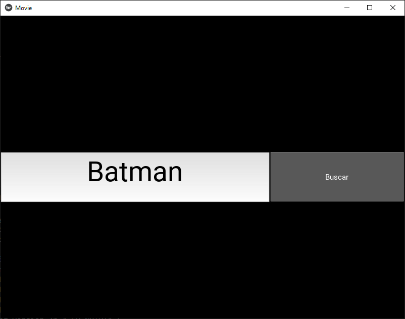
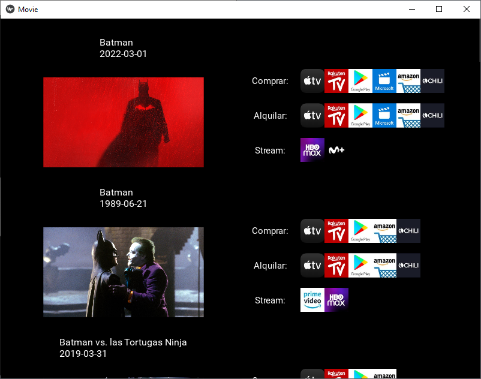

# INFORMACIÓN
App que permite buscar en que plataforma está disponible la película. Nos da información de donde se puede comprar, alquilar o ver en streaming la película seleccionada. Para ello utilizamos un requests a la API de TMBD. Utilizamos hilos para poder realizar múltiples llamadas a la API y que esto no repercuta en nuestro tiempo de respuesta.

# FRAMEWORKS IMPORTANTES

- KIVY (nos permite crear la app)
- Requests (para hacer llamadas a la API)
- Threading (realizar varias llamadas a la vez)

# VISUALIZACIÓN

